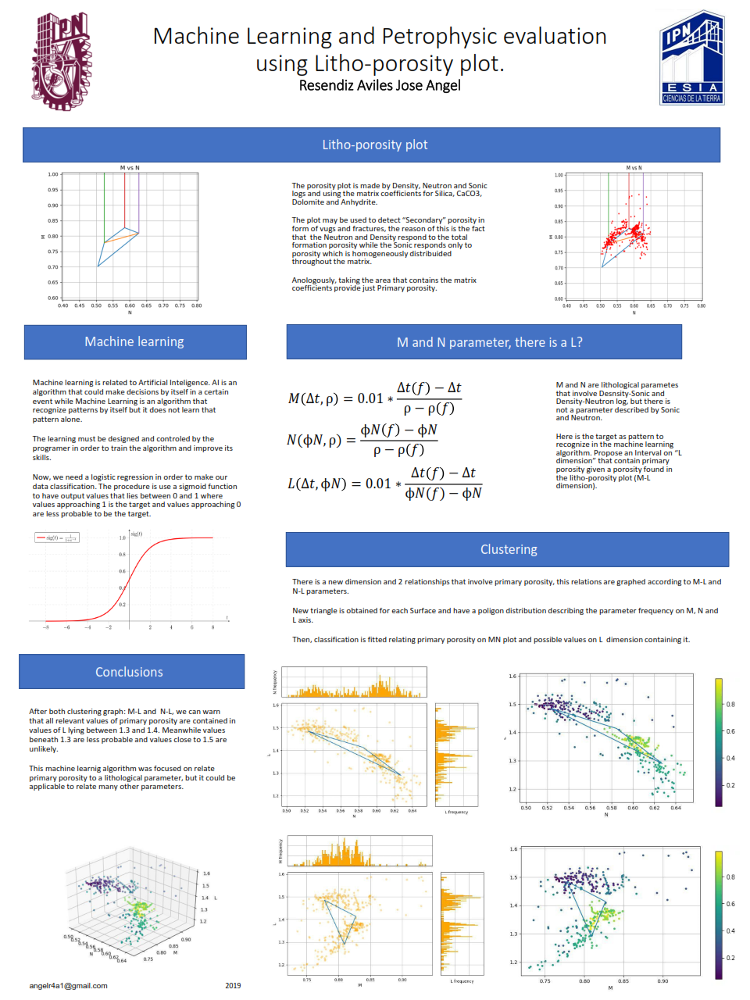

# Petrophysics tool visualizator
This is a GUI application to load some spreadsheet and make a solid dataframe using elemental logs.

## 3D Well log by scatter data

## Litological parameters M & N 

## 3D Litologial parameters M, N and L

## Publications
This is the main tool used to develop a poster on "Second EAGE/AMGP/AMGE Latin-American Seminar in Unconventional Resources, Mexico City, 2019"

---
The pdf file for this poster is available on this repository root

