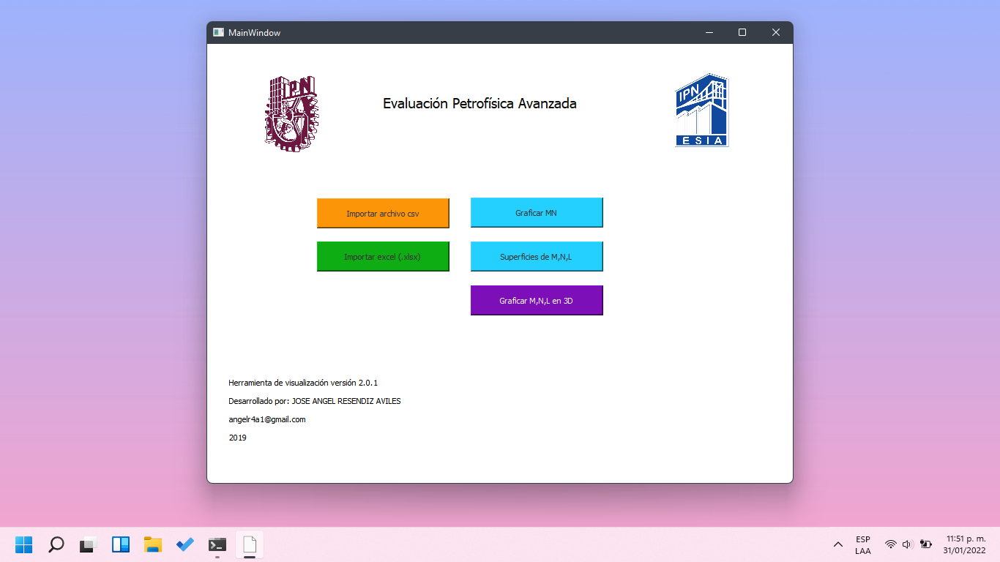
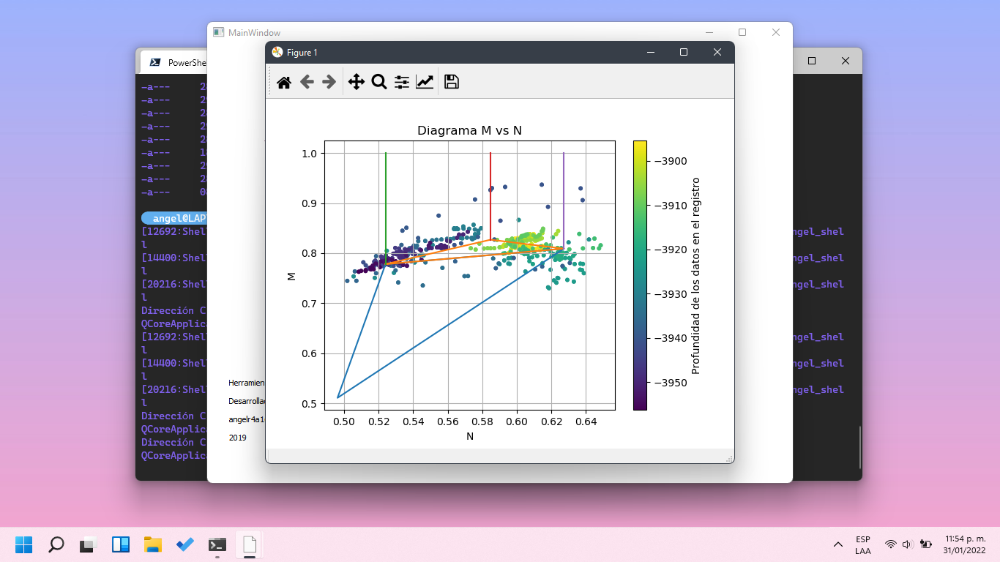
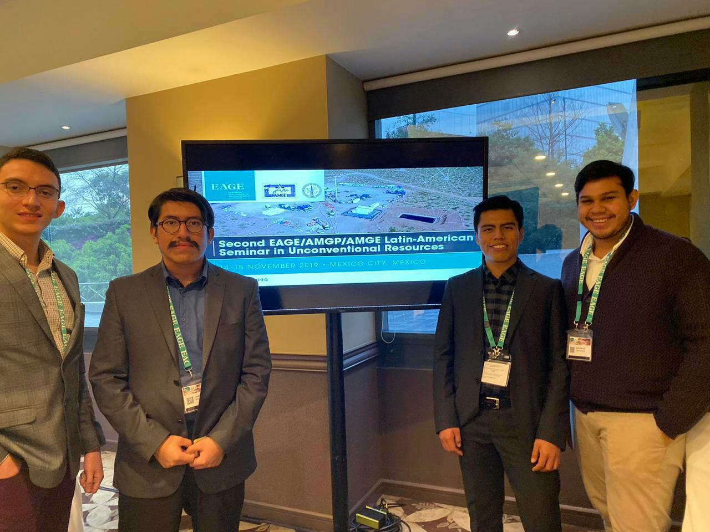

# Petrophysics tool visualizator
This is a GUI application to load some spreadsheet and make a solid dataframe using elemental logs.

## 3D Well log by scatter data
---

## Litological parameters M & N 
---

## 3D Litologial parameters M, N and L
---

## Publications
---
This is the main tool used to develop a poster on "Second EAGE/AMGP/AMGE Latin-American Seminar in Unconventional Resources, Mexico City, 2019"

<object data="Angelpacman.github.io/poster.pdf" type="application/pdf" width="700px" height="700px">
    <embed src="Angelpacman.github.io/poster.pdf">
        
This browser does not support PDFs. Please download the PDF to view it: <a href="Angelpacman.github.io/poster.pdf">Download PDF</a>.

    </embed>
</object>

<a href="Angelpacman.github.io/poster.pdf" target="_blank">PDF.</a>
